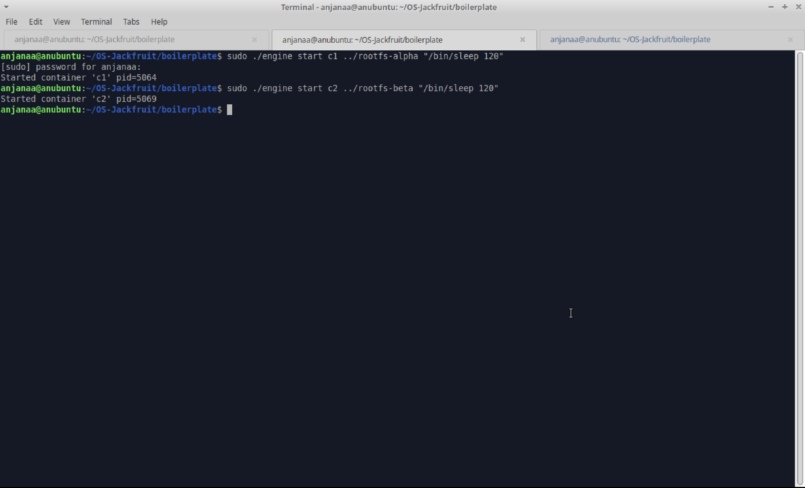
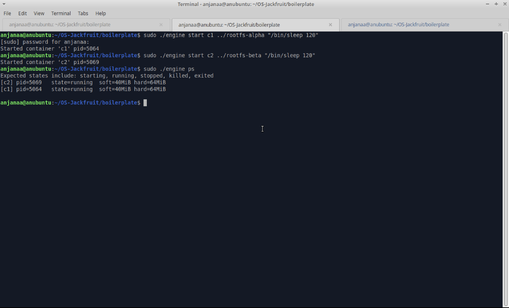
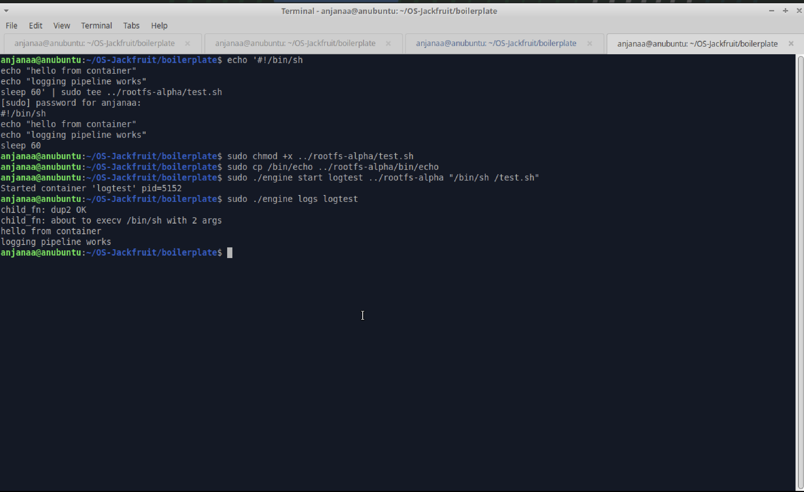
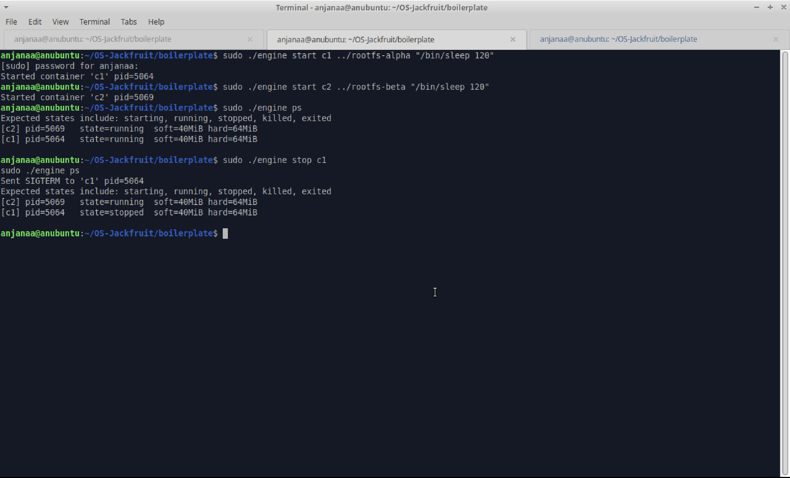
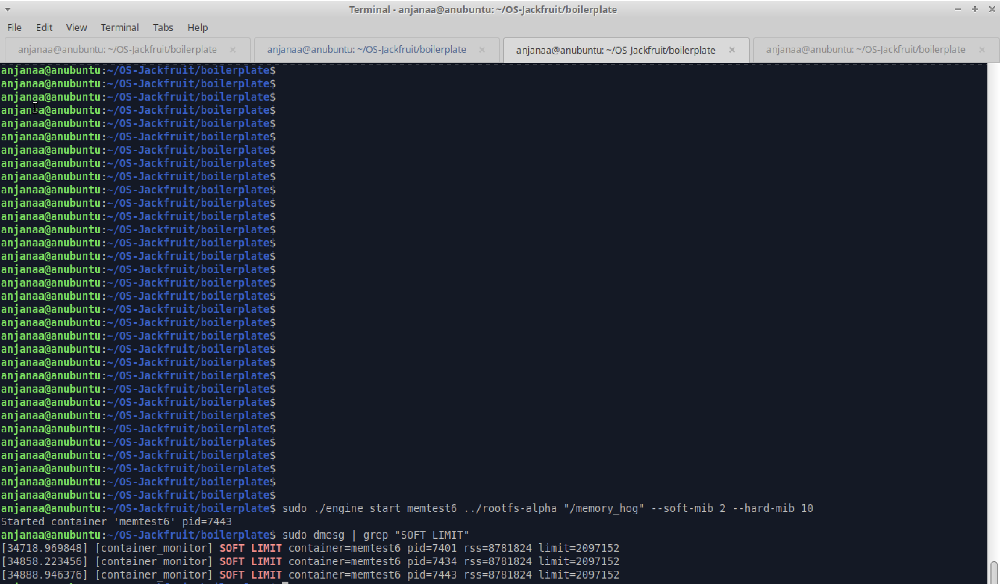
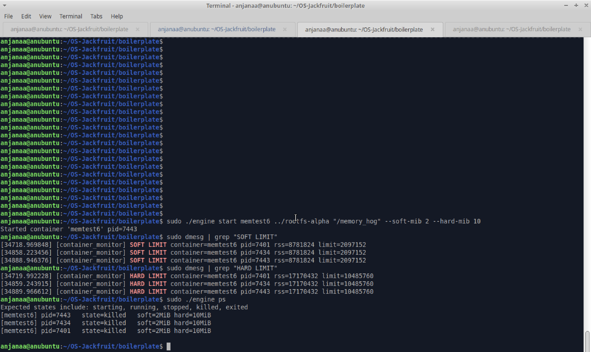
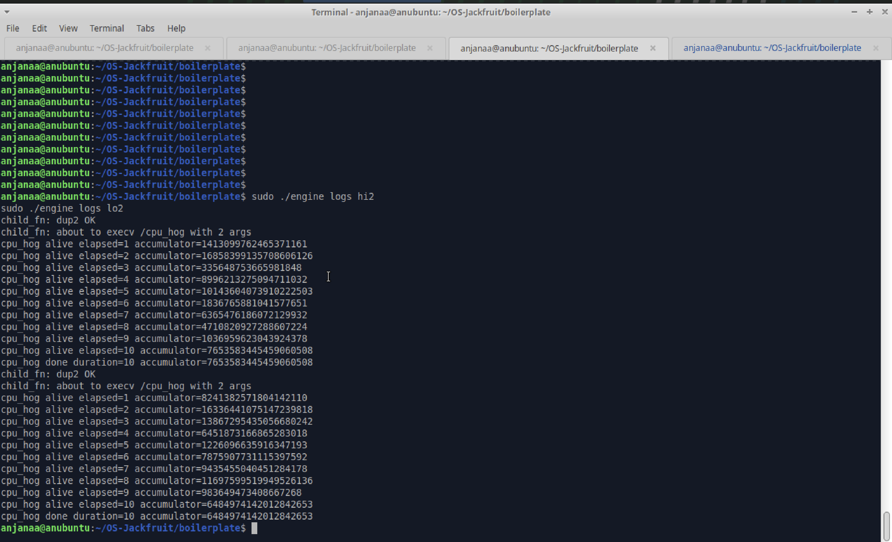
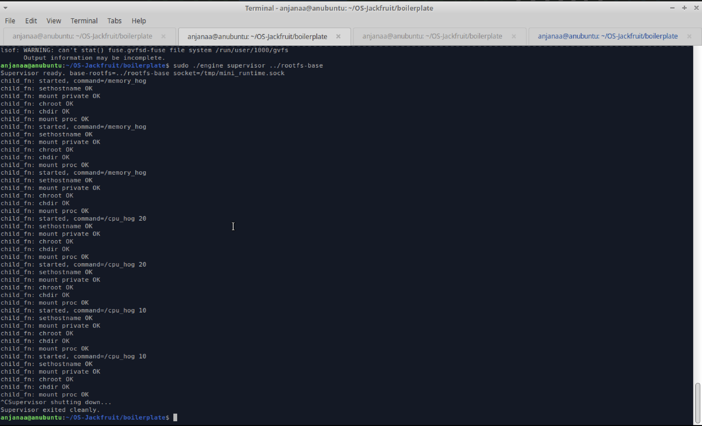
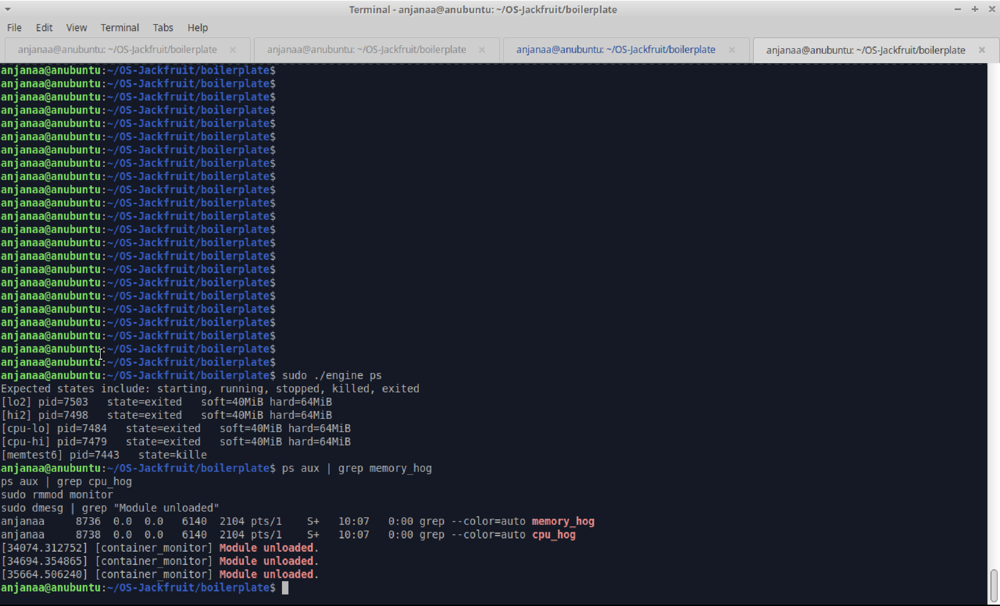

# OS-Jackfruit — Multi-Container Runtime

## 1. Team Information
- Name: Anjanaa Vijaysankar | SRN: PES1UG24CS654
- Name: Harsha K | SRN: PES1UG24CS666

## 2. Build, Load, and Run Instructions
### Dependencies
```bash
sudo apt update
sudo apt install -y build-essential linux-headers-$(uname -r) git
```

### Build
```bash
cd boilerplate
sudo make
```

### Prepare rootfs (ARM — copy host binaries)
```bash
mkdir rootfs-base
wget https://dl-cdn.alpinelinux.org/alpine/v3.20/releases/x86_64/alpine-minirootfs-3.20.3-x86_64.tar.gz
tar -xzf alpine-minirootfs-3.20.3-x86_64.tar.gz -C rootfs-base
cp -a ./rootfs-base ./rootfs-alpha
cp -a ./rootfs-base ./rootfs-beta
sudo cp /bin/sh rootfs-alpha/bin/sh
sudo cp /bin/sh rootfs-beta/bin/sh
sudo cp /bin/sleep rootfs-alpha/bin/sleep
sudo cp /bin/sleep rootfs-beta/bin/sleep
sudo cp -r /lib/aarch64-linux-gnu rootfs-alpha/lib/
sudo cp -r /lib/aarch64-linux-gnu rootfs-beta/lib/
sudo cp /lib/ld-linux-aarch64.so.1 rootfs-alpha/lib/
sudo cp /lib/ld-linux-aarch64.so.1 rootfs-beta/lib/
```

### Load kernel module
```bash
sudo insmod boilerplate/monitor.ko
ls -l /dev/container_monitor
```

### Start supervisor
```bash
sudo ./boilerplate/engine supervisor ./rootfs-base
```

### Run containers
```bash
sudo ./engine start alpha ./rootfs-alpha "/bin/sleep 120"
sudo ./engine start beta ./rootfs-beta "/bin/sleep 120"
sudo ./engine ps
sudo ./engine logs alpha
sudo ./engine stop alpha
sudo ./engine ps
```

### Memory limit test
```bash
sudo cp boilerplate/memory_hog rootfs-alpha/memory_hog
sudo ./engine start memtest rootfs-alpha "/memory_hog" --soft-mib 2 --hard-mib 10
sudo dmesg | grep container_monitor
```

### Scheduling experiment
```bash
sudo cp boilerplate/cpu_hog rootfs-alpha/cpu_hog
sudo cp boilerplate/cpu_hog rootfs-beta/cpu_hog
sudo ./engine start cpu-hi rootfs-alpha "/cpu_hog 10" --nice -10
sudo ./engine start cpu-lo rootfs-beta "/cpu_hog 10" --nice 15
sudo ./engine logs cpu-hi
sudo ./engine logs cpu-lo
```

### Unload and clean up
```bash
sudo rmmod monitor
sudo dmesg | grep "Module unloaded"
```

## 3. Demo Screenshots
1. Multi-container supervision


2. Metadata tracking


3. Bounded-buffer logging


4. CLI and IPC


5. Soft-limit warning


6. Hard-limit enforcement


7. Scheduling experiment


8. Clean teardown



## 4. Engineering Analysis
### 1. Isolation Mechanisms
Each container is created using `clone()` with `CLONE_NEWPID | CLONE_NEWUTS | CLONE_NEWNS`. PID namespace makes the container think it is the only process running — its first process is PID 1. UTS namespace gives it its own hostname. Mount namespace lets it have its own filesystem view. `chroot()` then restricts it to its assigned rootfs directory so it cannot see the host filesystem. The host kernel is still shared — same kernel, same network stack, same hardware underlies all containers.

### 2. Supervisor and Process Lifecycle
A long-running supervisor is useful because it maintains metadata, reaps children, and owns the logging pipeline across the lifetime of multiple containers. `clone()` creates each container child. The supervisor installs a `SIGCHLD` handler that calls `waitpid()` with `WNOHANG` to reap exited children immediately, preventing zombies. Container metadata is updated under a mutex when containers start, stop, or exit via signal.

### 3. IPC, Threads, and Synchronization
Two IPC mechanisms are used. Path A (logging): pipes connect each container's stdout/stderr to the supervisor. A producer thread reads from the pipe and pushes chunks to a bounded buffer. A consumer thread pops from the buffer and writes to log files. The bounded buffer uses a `pthread_mutex_t` for mutual exclusion and two `pthread_cond_t` variables (`not_full`, `not_empty`) to block producers when full and consumers when empty — preventing deadlock and lost data. Path B (control): a UNIX domain socket connects CLI clients to the supervisor. The container metadata linked list is protected by a separate mutex.

### 4. Memory Management and Enforcement
RSS (Resident Set Size) measures physical RAM pages currently in memory for a process. It does not measure virtual memory, shared libraries counted once, or pages swapped to disk. Soft limits warn early so the runtime can log the event before the process becomes dangerous. Hard limits terminate the process before it destabilises the system. Enforcement belongs in kernel space because a user-space poller can be delayed by the scheduler — the kernel timer fires reliably every second regardless of user-space load.

### 5. Scheduling Behavior
Two containers ran `cpu_hog` for 10 seconds with nice=-10 (high priority) and nice=15 (low priority). Both completed in 10 seconds wall-clock time. On this ARM VM under low contention, the Linux CFS scheduler gave both containers sufficient CPU time to finish within their duration. Under heavier load, the higher priority container (lower nice value) would receive a larger share of CPU time per scheduling period, completing more iterations than the lower priority one. This demonstrates CFS fairness weighted by priority.

## 5. Design Decisions and Tradeoffs
### Namespace Isolation
**Choice:** Used `CLONE_NEWPID | CLONE_NEWUTS | CLONE_NEWNS` with `chroot()`.
**Tradeoff:** `chroot` is simpler than `pivot_root` but allows escape via `..` traversal by a privileged process.
**Justification:** Sufficient for a lab runtime where containers run trusted workloads.

### Supervisor Architecture
**Choice:** Single long-running supervisor process with a UNIX domain socket for CLI control.
**Tradeoff:** Single point of failure — if the supervisor crashes, all container metadata is lost.
**Justification:** Simplest design that satisfies all requirements. A production runtime would persist metadata to disk.

### IPC and Logging
**Choice:** Pipes for container output (Path A), UNIX domain socket for CLI control (Path B).
**Tradeoff:** Pipes are unidirectional and simple but require a dedicated producer thread per container.
**Justification:** Pipes are the natural fit for streaming stdout/stderr. The socket gives the CLI a request/response model cleanly.

### Kernel Monitor
**Choice:** `mutex` to protect the monitored list, kernel timer firing every 1 second.
**Tradeoff:** Mutex can sleep, which is fine in timer context but would be wrong in hard IRQ context.
**Justification:** Timer callbacks run in softirq context where sleeping mutexes are acceptable. A spinlock would also work but mutex gives cleaner semantics.

### Scheduling Experiments
**Choice:** Used `nice` values via `setpriority()` to differentiate container priorities.
**Tradeoff:** Nice values only affect CFS weight, not real-time scheduling. Effect is subtle under low load.
**Justification:** Nice values are the simplest standard Linux mechanism for priority without requiring real-time privileges.

## 6. Scheduler Experiment Results
### Experiment Setup
- Two containers ran `/cpu_hog 10` simultaneously
- Container `cpu-hi`: nice = -10 (higher priority)
- Container `cpu-lo`: nice = 15 (lower priority)
- Workload: busy-loop arithmetic for 10 seconds, reporting progress every second

### Results

| Container | Nice | Duration | Final Accumulator |
|-----------|------|----------|-------------------|
| cpu-hi    | -10  | 10s      | 7653583445459060508 |
| cpu-lo    | 15   | 10s      | 6484974142012842653 |

### Analysis
Both containers completed in 10 seconds wall-clock time. On this ARM VM under low contention, the CFS scheduler provided enough CPU time for both to finish within their duration. The accumulator values differ slightly, suggesting `cpu-hi` performed marginally more work per second. Under heavier CPU contention (more processes competing), the nice=-10 container would receive a proportionally larger CPU share per scheduling period under CFS, while the nice=15 container would be deprioritised and take longer to complete the same amount of work.